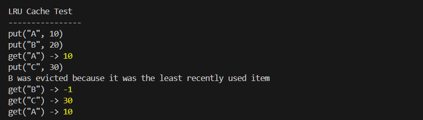

# LRU Cache

A simple Least Recently Used (LRU) Cache implementation in JavaScript.

This project was created as part of a Frontend Developer Intern practical assessment to demonstrate JavaScript problem-solving, data structure usage, and time complexity understanding.

## Requirements

The cache supports:

- `Cache(capacity)`
- `get(key)`
- `put(key, value)`

The required behavior is:

- The cache has a fixed positive capacity.
- `get(key)` returns the stored value if the key exists.
- `get(key)` returns `-1` if the key does not exist.
- A successful `get()` makes that key the most recently used item.
- `put(key, value)` adds a new key/value pair or updates an existing one.
- When the cache exceeds its capacity, the least recently used item is removed.
- `get()` and `put()` run in O(1) average time.

## Project Structure

```text
lru-cache/
│
├── src/
│   └── LRUCache.js
│
├── test/
│   └── example.js
│
├── screenshots/
│   └── output.png
│
├── package.json
└── README.md


## Test Result

The screenshot below shows the actual output generated by the LRU Cache implementation.

